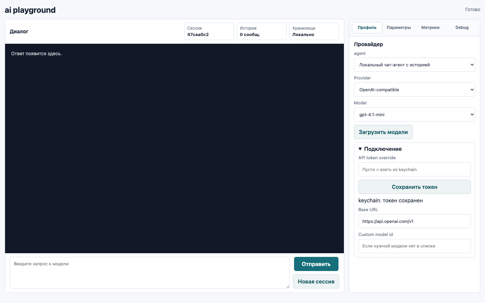
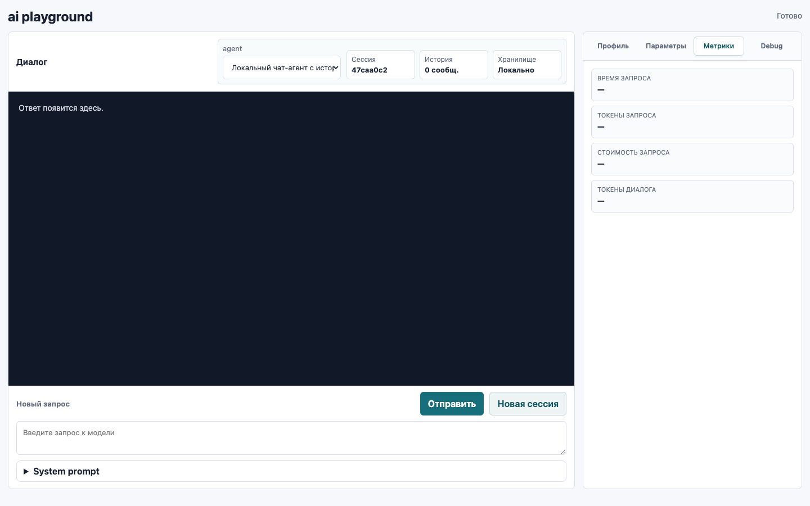

# Web UI

Локальный web UI запускается той же командой, что и раньше:

```bash
ai web
```

По умолчанию интерфейс доступен на `http://127.0.0.1:8787`.

## Основной экран

Web UI в версии 1.0 построен вокруг диалога: слева находится большая область переписки и поле нового запроса, справа - inspector с настройками, метриками и debug.



## Как пользоваться

1. Откройте `ai web`.
2. Во вкладке `Профиль` выберите provider и model.
3. Если токен еще не сохранен, вставьте его в `API token override` и нажмите `Сохранить токен`.
4. Введите запрос в поле `Новый запрос`.
5. Нажмите `Отправить`.

Кнопка `Новая сессия` начинает отдельный локальный диалог. История и memory хранятся локально, токены в историю не пишутся.

Поля `max_tokens` и `max_completion_tokens` пустые по умолчанию. Пустое поле означает, что лимит не будет отправлен provider API. Чтобы ограничить ответ, введите число вручную во вкладке `Параметры`.

`System prompt` сохраняется как первое системное сообщение агентной сессии. При возврате в сохраненную сессию Web UI восстанавливает его во вкладке `Параметры`, чтобы агент продолжал работу с той же ролью и инструкциями.

## Inspector

- `Профиль` - provider, model, загрузка live model list, token status, base URL и custom model id.
- `Параметры` - sampling, token limits, reasoning, verbosity, pricing, Billing API и extra API parameters.
- `Метрики` - статистика последнего запроса и накопленная статистика текущего диалога.
- `Debug` - provider request/response JSON с отредактированным authorization header.

## Метрики токенов

Вкладка `Метрики` намеренно разделяет два уровня:

- `Токены запроса` - только последний provider API вызов.
- `Токены диалога` - сумма по текущей web session.

Если provider возвращает подробности usage, UI показывает breakdown:

- `prompt`
- `completion`
- `prompt cached`
- `prompt uncached`
- `prompt audio`
- `visible output`
- `reasoning`
- `output audio`
- `accepted prediction`
- `rejected prediction`
- `total`



## Токены и хранение

Web UI использует тот же secret слой, что CLI:

- сначала системный keychain;
- затем локальный fallback `secrets.toon`, если keychain недоступен или не отдает сохраненное значение.

Fallback-файл лежит в локальной data-директории приложения и на Unix создается с правами `0600`. Токены не пишутся в `config.toml`, history, memory или debug output.

## TOON

Локальные session data и metrics сохраняются в TOON там, где формат поддерживает нужные структуры. Старый JSON-файл session metrics читается как legacy fallback, но новые metrics пишутся в `.metrics.toon`.
